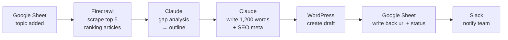

# AI Content Pipeline

A fully automated, research-backed SEO content pipeline. Add a topic to a Google Sheet; a WordPress draft appears five minutes later and Slack tells you it's ready.

Built with **n8n Cloud** — no backend, no database, no frontend, no deployment.

---

## The Problem

Writing one research-backed SEO article takes 4–5 hours:

| Step | Time |
|---|---|
| Research the topic, read 5 competitor articles | ~60 min |
| Write an outline | ~30 min |
| Write the article | 2–3 hrs |
| Meta title + description | ~15 min |
| Log into WordPress, paste, format, tag, save draft | ~20 min |
| Tell the team it's ready | ~5 min |

A marketing agency with 10 clients needing 4–8 articles a week each cannot make that math work. So what actually happens is: content ships inconsistently, quality drops, SEO opportunities get missed, and clients complain.

### Why existing tools don't close the gap

| Tool | What's missing |
|---|---|
| ChatGPT / Claude directly | No competitor research, no publishing, no workflow — you drive every step |
| Jasper / Copy.ai | $50–100/mo, generic output, still manual publishing |
| Hiring writers | $50–200/article, slow, still needs briefing and editing |

All three require significant human input at every step. None are *end to end*.

---

## The Solution



The human does two things: **add a topic**, and **review + publish the draft**. The machine does everything in between.

### Why this beats prompting an LLM directly

An LLM alone writes from training data. This pipeline reads **what is actually ranking today**, finds the questions those articles fail to answer, and writes to fill those gaps. The output is grounded in live search results, not recall.

### Before vs after

| | Before | After |
|---|---|---|
| Human time per article | 4–5 hours | ~10 minutes |
| Research | Manual, 5 tabs | Automated scrape of live SERP |
| Publishing | Copy, paste, format, tag | Draft already in WordPress |
| Consistency | Whenever there's time | Every topic in the sheet |

---

## Tech Stack

| Layer | Choice | Why |
|---|---|---|
| Trigger + database + UI | **Google Sheets** | The topic list *is* the interface. No schema, no admin panel. |
| Orchestration | **n8n Cloud** | Visual workflow. Each step is a node, not a function. Hosted. |
| Research | **Firecrawl** | Search + scrape in one call; returns clean markdown, not raw HTML |
| Analysis + writing | **Claude API** (`claude-opus-5`) | Gap analysis and long-form drafting in two separate, focused calls |
| Publishing | **WordPress REST API** | Application password auth, `status: draft` |
| Notification | **Slack incoming webhook** | One POST, no OAuth app to build |

**Nothing to deploy.** n8n Cloud hosts and runs the workflow.

### How this differs from my other projects

| | BI Agent | This pipeline |
|---|---|---|
| Backend | FastAPI (Python) | None — n8n handles it |
| Database | PostgreSQL | Google Sheets |
| UI | Next.js | Google Sheets |
| Orchestration | LangGraph (code) | n8n (visual) |
| Deployment | Docker + Railway | n8n Cloud |
| Lines of code | Many | Near zero |

Deliberately the inverse of the BI Agent: same problem shape (multi-step LLM workflow with tool calls), opposite implementation philosophy.

---

## Repository Layout

```
ai-content-pipeline/
├── README.md              ← you are here: problem, solution, stack
├── PLAN.md                ← phased build plan with checkboxes
├── .env.example           ← the credentials this pipeline needs
├── prompts/               ← Claude prompts, versioned separately from the workflow
│   ├── 01-gap-analysis.md
│   └── 02-article-writer.md
└── workflows/             ← exported n8n workflow JSON
```

The prompts live outside the n8n workflow on purpose: they are the part most worth iterating on, and diffing a Markdown file beats diffing a 2,000-line JSON export.

---

## Status

🔨 **In progress** — see [PLAN.md](PLAN.md) for the phase-by-phase build.

Nothing here is running in production yet. This is a portfolio build.
